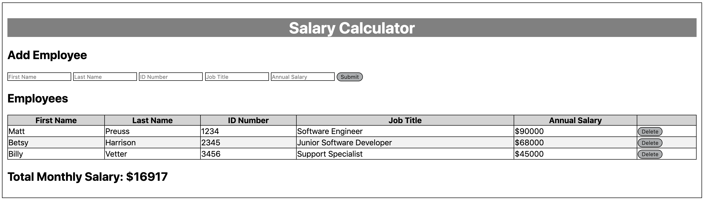
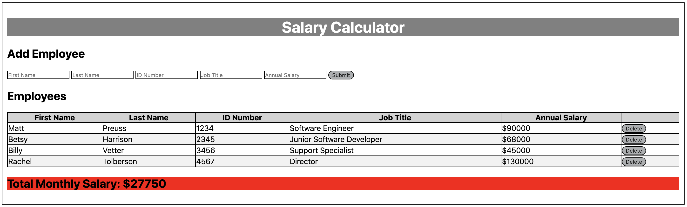

# Employee Salary Calculator
---

## Description

Duration: 1 Weekend Sprint

This project created a employee salary calculator for use by employers.  This calculator takes in _employee first name, last name, ID number, job title, annual salary_.  When the submit button is clicked the calculator stores the  information, calculates monthly costs, and appends this to the DOM.  If the total monthly costs exceed $20,000, a red background color will display.  If you need to delete an employee from the DOM simple click the delete button on the right side of the page.  This calculator can help make sure your employee salaries are not impacting your bottom line.
---
Screen shot

---

## Installation

1. fork this repository to your own github account
2. git clone onto local computer using terminal
3. open with code editor of your choice
4. open index.html file in browser
---

## Usage

1. input first name
2. input second name
3. input ID number
4. input job title
5. annual salary
6. click submit button
7. continue inputing employees as neccesary
---
## Built With

- html
- css
- javascript
- jQuery.js
---
## Acknowledgment 

Thanks to Luke Schlangen and Prime Academy who equipped me to make this application a reality
---
## Support

If you have suggestions or issues, please email me at <Luke.Schleder@gmail.com>